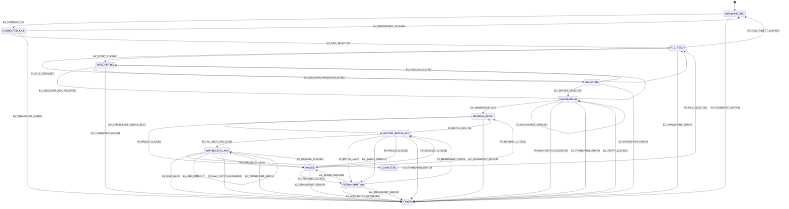

# gateway-ota OTA 송신 FSM 설계

`gateway-ota`(라즈베리파이 Qt 앱)의 OTA 송신 쪽 최상위 상태기계 설계 문서.
`firmware-esp32`의 `fhss-ota-radio/docs/fsm-design.md`(수신 측 FSM)와 짝을 이루는
문서로, 형식(상태표/이벤트표/전이표/다이어그램)을 그쪽에 맞춰 작성했다.

> 패킷 포맷(`ota_protocol.h` v0.2, DISCOVER/DISCOVER_ACK 포함)과 재전송 전략
> (Selective-Repeat, 고정 크기 배치)은 확정됐습니다. 상태/이벤트 이름 자체는
> 안정적이나, 재시도 횟수·타임아웃·배치 크기 같은 구체적인 숫자(현재 타임아웃
> 300ms×재시도 5회는 CC1101 데이터레이트(38.4kbps)가 아직 미검증 임시값인
> 상태에서 잡은 시작값)는 실기기 테스트 전까지 조정될 수 있습니다.

## 한눈에 보기

| 상태 | 한 줄 요약 |
|---|---|
| `DISCONNECTED` | `/dev/cc1101` 미연결 (앱 시작 직후 기본 상태) |
| `CONNECTED_IDLE` | 연결됨, 아직 BIN 파일 선택 안 함 |
| `FILE_READY` | BIN 파일 선택 + 청크 분할 완료, 전송 대기 |
| `DISCOVERING` | `OTA_DISCOVER` 브로드캐스트 후 응답 수집 중 (고정 3초 창) |
| `SELECTING` | 조회된 기기 목록 표시, 사용자의 대상 선택 대기 |
| `HANDSHAKING` | 선택된 대상에게 START 패킷 전송, 상대 단말 확인 대기 |
| `SENDING_BATCH` | 현재 배치(윈도우)의 청크를 순서대로 전송 중 |
| `WAITING_BATCH_ACK` | 배치 전송 완료, 상대의 배치 확인 대기 |
| `RETRANSMITTING` | 배치 내 누락된 청크만 재전송 중 |
| `WAITING_END_ACK` | 모든 배치 전송 완료 후 `OTA_END` 전송, 최종 검증(SHA256) 결과 대기 |
| `PAUSED` | 사용자가 일시정지 (전송 관련 상태 어디서든 진입 가능) |
| `COMPLETED` | `OTA_END`까지 확인 완료 (상대가 SHA256 검증·재부팅까지 마침) |
| `FAILED` | 복구 불가 오류 (핸드셰이크/배치/END 재시도 초과, 전송 오류, 최종 검증 실패 등) |

상세 설명은 [§2 상태](#2-상태-states), 전이 규칙은 [§4 상태 전이표](#4-상태-전이표) 참고.

## 결정 이력

| 날짜 | 결정 | 이유 / 트레이드오프 |
|---|---|---|
| 2026-08-11 | `firmware-esp32`의 `fsm-design.md`를 참고하되, 거기 맞춰 억지로 끼워 맞추지 않고 우리 쪽 초안으로 먼저 작성 | 그쪽 문서도 계속 바뀌는 중(결정 이력이 여러 번 갱신됨)이라, 고정된 제약으로 보기보다 서로 맞춰갈 대상으로 취급. 배치 확인 방식처럼 우리 제안으로 `fsm-design.md` 쪽 이벤트가 늘어날 수도 있음 |
| 2026-08-11 | 배치(윈도우) 기반 확인 방식을 전제로 `HANDSHAKING`/`SENDING_BATCH`/`WAITING_BATCH_ACK`/`RETRANSMITTING` 4단계로 분리 | 청크당 ACK(왕복 과다)와 ACK 없음(실패 시 전체 재전송) 둘 다 문제가 있어 그 중간으로 설계 — 근거는 `ota-protocol` 디자인노트 참고. **`ota-protocol` 팀 합의 전까지는 상태/이벤트 이름과 세부 전이가 바뀔 수 있음** |
| 2026-08-11 | `PAUSED`를 별도 상태 하나로만 두고, 재개 시 돌아갈 상태는 FSM 상태가 아니라 별도로 저장 | ESP32 쪽 설계 원칙과 동일 — "이벤트/상태는 가볍게 유지하고, 세부 진행 데이터(어느 배치·몇 번째 청크였는지)는 FSM 바깥의 멤버 변수로 관리"(`fsm-design.md`의 `fsm_post_rx_audio_frame` 큐 분리와 같은 이유). `SENDING_BATCH`/`WAITING_BATCH_ACK`/`RETRANSMITTING`마다 별도 `PAUSED_*` 상태를 만들면 상태 수만 늘어나고 이득이 없음 |
| 2026-08-11 | 핸드셰이크·배치·`OTA_END` 재시도를 각각 별개의 재시도 카운터로 관리 (표에는 모두 `EV_MAX_RETRY_EXCEEDED`로만 표기) | 실제 구현에서는 `OtaSession`(가칭) 내부에 단계별 카운터가 따로 있어야 함(카운터는 별개, 다만 타임아웃/한도 *값*은 아래 300ms×5회로 통일). 이 문서는 상태 전이만 다루고 카운터 구조는 구현 매핑에서 결정 |
| 2026-08-11 | `ota_protocol.h`를 v0.2로 확정(`plan_A.md` 채택) — START/DATA/END/ACK/NACK 5종, `session_id` 포함 | 자세한 내용은 `ota-protocol`의 README/설계노트 참고. 이 문서의 `HANDSHAKING`(START 패킷)과 `WAITING_BATCH_ACK`(ACK/NACK)는 이제 실제 패킷 타입과 1:1로 대응됨 — 더 이상 "패킷 타입이 없어서 설계 문서 단계로만 유지" 상태가 아님 |
| 2026-08-11 | 재전송 전략을 **Selective-Repeat + 고정 크기 배치(초기값 `batchSize=3`)**로 확정, 새 패킷 타입(블록 비트맵 NACK) 없이 기존 개별 ACK/NACK 재사용 | `batchSize=1`이면 Stop-and-Wait과 동일 동작이라 `plan_A.md`의 안전한 1차 방향과 배치 방식을 동시에 만족. 근거는 `ota-protocol` 설계노트 "재전송 전략 확정" 절. `EV_BATCH_NACK`/`EV_BATCH_ACK_OK`는 "배치 패킷 하나"가 아니라 "배치 안의 개별 ACK/NACK/타임아웃들을 다 처리한 결과"로 재해석됨 (§6 알고리즘 참고). 슬라이딩 윈도우가 아니라 고정 크기 배치임에 유의 |
| 2026-08-11 | `WAITING_END_ACK` 상태 추가 — `EV_ALL_BATCHES_DONE` 후 바로 `COMPLETED`로 가지 않고, `OTA_END`를 실제로 보내고 그 ACK/NACK(SHA256 검증 결과)을 기다리는 단계를 신설 | 기존 설계는 "모든 청크가 개별 ACK됐다"만 확인하고 끝냈는데, `OTA_END`(→ 상대가 남은 flash 기록·SHA256 전체 검증·재부팅)를 실제로 보내고 그 결과를 확인하는 절차가 FSM에 없었음 (`plan_A.md` §9 기준 END는 송신 측(우리)이 보내는 패킷). `HANDSHAKING`(START 보내고 ACK 대기)과 대칭 구조 |
| 2026-08-11 | `DISCOVERING`/`SELECTING` 상태 추가 — `FILE_READY`에서 바로 `HANDSHAKING`으로 가지 않고, 먼저 `OTA_DISCOVER`로 대기중인 기기를 조회해서 목록을 모으고(`DISCOVERING`), 사용자가 그 목록에서 대상을 고르면(`SELECTING`) 그 `device_id`로 `HANDSHAKING`(START)에 진입 | "상대가 하나로 정해져 있다"는 기존 전제 대신, 여러 기기 중 사용자가 화면에서 골라서 보내는 방식으로 요구사항이 바뀜 (`ota-protocol` 설계노트 "대상 기기 조회/선택 추가" 절 참고). 새 패킷 타입(`OTA_PKT_DISCOVER`/`OTA_PKT_DISCOVER_ACK`)이 `ota_protocol.h`에 추가됐지만 START 이후 흐름은 안 바뀜. 조회 창은 고정 3초 + 재조회 버튼(`EV_RESCAN_CLICKED`)으로 결정 — 사용자가 계속 열어두는 방식 대비 구현이 단순하고, 나중에 필요하면 조회 창 길이(duration)만 늘리는 걸로 확장 가능하게 설계 |
| 2026-08-11 | `batchSize` 초기값을 3 → **5**로 변경 | 청크(payload 47byte) 5개 = 235byte, 여전히 ESP32 4096byte 플래시 버퍼에 비하면 아주 작은 양이라 버퍼 오버플로 걱정 없음. 타임아웃/재시도(300ms×5회)를 정하면서 같이 조정 — 파라미터 하나만 바꾸면 되는 구조라 `batchSize=3`으로 남겨둘 이유가 딱히 없어서 실기기 테스트 전 시작값을 5로 높임 |
| 2026-08-11 | 타임아웃/재시도 시작값을 **300ms × 5회**(모든 단계 통일)로 결정 | 무전기가 조회 후 선택했다가 모드를 바꿔 나가버리는 경우도 "응답이 안 온다"는 신호로는 일반적인 패킷 유실과 구분이 안 되므로, 기존 타임아웃+재시도 메커니즘이 그대로 끊김 감지 역할을 겸함 — 확인 과정에서 결정. `DISCOVERING`/`SELECTING` 도입으로 `HANDSHAKING` 진입 시점엔 이미 상대가 `MENU_OTA`에 있다는 게 확인된 상태라, 원래 `HANDSHAKING`을 유독 관대하게 잡을 이유(상대가 아직 준비 안 됐을 수도 있다는 전제)가 사라져서 세 단계(핸드셰이크/배치재전송/END)를 굳이 다르게 안 가져가고 하나로 통일. 근거: CC1101 데이터레이트가 아직 38.4kbps 미검증 임시값(`kernel-cc1101-spi/README.md`)뿐이라 정밀 계산은 불가능하지만, 최대 패킷(60byte) 전송 시간이 이론상 약 12.5ms 수준이라 300ms는 충분한 안전마진. 재시도 5회 → 단계당 최대 대기 1.5초. 실기기 테스트 후 조정 예정 |

## 1. 설계 전제

#### 상대가 준비 안 됐을 수 있음
- `firmware-esp32`의 `fsm-design.md` 기준, 수신 측은 사용자가 로터리 엔코더로
  `MENU_OTA`에 수동 진입해야만 OTA를 받는다 (자동 진입 없음). 즉 `HANDSHAKING`에서
  상대가 아직 `MENU_IDLE`(음성 대기)일 수 있으므로, START에 대한 응답이 안 올 수
  있다는 걸 전제로 재시도/타임아웃을 설계한다.

#### 고정 크기 배치 확인 — wire format은 확정, `batchSize`만 튜닝 대상
- `ota_protocol.h` v0.2(`plan_A.md` 채택)로 START/DATA/END/ACK/NACK 패킷 포맷은
  확정됐다. `SENDING_BATCH`→`WAITING_BATCH_ACK`→(`RETRANSMITTING`) 루프 자체는
  그대로 유효하고, 새 패킷 타입이 필요 없다 — "배치"는 물리적으로 다른 패킷이
  아니라 "`batchSize`개만큼의 DATA를 보내고 그만큼의 개별 ACK/NACK을 처리하는
  세션 로직 단위"일 뿐이다(슬라이딩 윈도우 아님, §6 알고리즘 참고).
- 남은 튜닝 대상은 **`batchSize` 하나뿐**: 초기값 5(2026-08-11, §6 참고)로
  시작하고, 나중에 처리량이 부족하면 숫자만 올리면 된다. `batchSize=1`이면
  Stop-and-Wait과 동일 동작이라 언제든 비교 테스트 가능.

#### 화면(Qt)과 로직의 경계
- 이 FSM 자체는 `core/`에 Qt 의존성 없이 구현하는 걸 전제로 한다(`BinSplitter`/
  `ITransport`와 같은 원칙). `ui/otamanager.cpp`는 이 FSM이 올리는 이벤트/콜백을
  받아 진행률 바·로그·버튼 상태만 갱신하는 얇은 계층으로 둔다.
- 반대로 사용자 클릭(연결, 파일 선택, 시작, 일시정지)은 화면에서 발생해서 FSM에
  이벤트로 전달된다 — 즉 이 FSM은 "Qt가 없다"뿐이지 "화면과 무관하다"는 아니고,
  화면에서 오는 입력과 전송 계층에서 오는 입력을 둘 다 받는 조정자 역할이다.

## 2. 상태 (States)

| 상태 | 설명 | 진입/이탈 시 동작(구현 매핑 참고용) |
|---|---|---|
| `DISCONNECTED` | 앱 시작 직후 기본 상태. `/dev/cc1101` 미연결 | 진입 시 `Cc1101Transport::close()` |
| `CONNECTED_IDLE` | `Cc1101Transport::open()`+`startRx()` 성공, 파일 미선택 | |
| `FILE_READY` | `BinSplitter::split()` 성공, 청크 목록 확보됨 | 진입 시 진행률 UI를 "0 / N 청크"로 초기화 |
| `DISCOVERING` | `OTA_DISCOVER` 브로드캐스트, `OTA_DISCOVER_ACK` 수집 중 | 진입 시 `OTA_DISCOVER` 전송 + 3초 타이머 시작(기존 목록은 유지, 재조회 시 append) |
| `SELECTING` | 조회된 기기 목록(`targetCombo`)을 화면에 표시, 사용자 선택 대기 | 목록 갱신은 `DISCOVERING`에서 이미 끝났으므로 진입 시 별도 동작 없음 |
| `HANDSHAKING` | 선택된 `target_device_id`로 START 패킷(세션 ID·이미지 크기·총 청크 수) 전송, 확인 대기 | 타임아웃 타이머 시작 |
| `SENDING_BATCH` | 현재 배치의 청크를 순서대로 `ITransport::send()` | |
| `WAITING_BATCH_ACK` | 배치 확인(단일 ACK 또는 누락 목록) 대기 | 타임아웃 타이머 시작 |
| `RETRANSMITTING` | 배치 내 누락 청크만 재전송 | |
| `WAITING_END_ACK` | `OTA_END`(session_id·image_size·total_chunks) 전송, 최종 검증 결과 대기 | 진입 시 `OTA_END` 전송 + 타임아웃 타이머 시작 |
| `PAUSED` | 사용자 일시정지. 이전 상태·진행 위치는 별도 저장 | |
| `COMPLETED` | `OTA_END` ACK까지 확인 완료 (상대가 SHA256 검증·재부팅까지 마침) | 로그에 완료 표시, 시작 버튼 재활성화 |
| `FAILED` | 복구 불가 오류 | 에러 로그, 재시도 버튼 활성화 |

## 3. 이벤트 (Events)

| 이벤트 | 발생 주체 | 설명 |
|---|---|---|
| `EV_CONNECT_OK` / `EV_CONNECT_FAILED` | 연결 버튼 핸들러 | `Cc1101Transport::open()`+`startRx()` 결과 |
| `EV_DISCONNECT_CLICKED` | 연결 해제 버튼 | 전송 중(`m_transferring`)이 아닐 때만 유효 |
| `EV_FILE_SELECTED` | 파일 선택 다이얼로그 + `BinSplitter::split()` | 분할 성공 |
| `EV_FILE_ERROR` | `BinSplitter::split()` | 분할 실패 (파일 없음/청크 크기 초과 등) |
| `EV_START_CLICKED` | 전송 시작 버튼 | `DISCOVERING` 진입 (예전엔 바로 `HANDSHAKING`이었으나 조회 단계가 앞에 추가됨) |
| `EV_DISCOVER_ACK_RECEIVED` | `ITransport::recv()` (`OTA_DISCOVER_ACK`) | 기기 하나가 응답 — 목록에 추가/갱신(self-loop, 상태 변화 없음) |
| `EV_DISCOVER_WINDOW_ELAPSED` | 타이머(3초) | 조회 창 종료 → `SELECTING`으로, 그때까지 모인 목록 확정 |
| `EV_RESCAN_CLICKED` | 재조회 버튼 (`SELECTING`에서만 노출) | `DISCOVERING`으로 복귀, 기존 목록 유지한 채 재조회 |
| `EV_TARGET_SELECTED` | 대상 목록에서 사용자가 기기 선택 | 선택된 `device_id`를 `target_device_id`로 저장, `HANDSHAKING` 진입 |
| `EV_HANDSHAKE_ACK` | `ITransport::recv()` (START 응답 패킷) | 상대가 세션 시작에 응답 |
| `EV_HANDSHAKE_TIMEOUT` | 타임아웃 타이머 | 응답 없음, 재시도 카운터 증가 |
| `EV_BATCH_LAST_CHUNK_SENT` | 전송 루프 | 현재 배치의 마지막 청크까지 `send()` 성공 |
| `EV_BATCH_ACK_OK` | `ITransport::recv()` (배치 확인 패킷) | 이 배치는 누락 없음 |
| `EV_BATCH_NACK` | `ITransport::recv()` (배치 확인 패킷) | 이 배치 내 일부 청크 누락 (누락 목록 포함) |
| `EV_BATCH_TIMEOUT` | 타임아웃 타이머 | 배치 확인 응답 자체가 안 옴 |
| `EV_RETRANSMIT_DONE` | 전송 루프 | 누락분 재전송 완료, 다시 확인 대기로 |
| `EV_ALL_BATCHES_DONE` | 배치 루프 | 마지막 배치까지 확인 완료 → `OTA_END` 전송 단계로 |
| `EV_END_ACK` | `ITransport::recv()` (`OTA_END`에 대한 ACK) | 상대가 SHA256 검증 통과, 재부팅 진행 |
| `EV_END_NACK` | `ITransport::recv()` (`OTA_END`에 대한 NACK) | 상대의 최종 검증 실패(`result_code` 참고, 예: SHA256 불일치) |
| `EV_END_TIMEOUT` | 타임아웃 타이머 | `OTA_END`에 대한 응답 자체가 안 옴, 재시도 카운터 증가 |
| `EV_MAX_RETRY_EXCEEDED` | 재시도 카운터 | 핸드셰이크·배치·`OTA_END` 재시도 한도 초과 (전역) |
| `EV_PAUSE_CLICKED` / `EV_RESUME_CLICKED` | 일시정지 버튼 | |
| `EV_TRANSPORT_ERROR` | `ITransport`(연결 끊김, write 실패 등) | 전역, 즉시 `FAILED` |
| `EV_RETRY_CLICKED` | 재시도 버튼 (`FAILED` 상태에서만 노출) | `HANDSHAKING`부터 재시작 (청크 분할은 재사용) |

## 4. 상태 전이표

| 현재 상태 | 이벤트 | 다음 상태 | 비고 |
|---|---|---|---|
| `DISCONNECTED` | `EV_CONNECT_OK` | `CONNECTED_IDLE` | |
| `CONNECTED_IDLE` | `EV_DISCONNECT_CLICKED` | `DISCONNECTED` | |
| `CONNECTED_IDLE` | `EV_FILE_SELECTED` | `FILE_READY` | |
| `FILE_READY` | `EV_FILE_SELECTED` | `FILE_READY` | self-loop, 다른 파일 재선택 |
| `FILE_READY` | `EV_DISCONNECT_CLICKED` | `DISCONNECTED` | |
| `FILE_READY` | `EV_START_CLICKED` | `DISCOVERING` | `OTA_DISCOVER` 브로드캐스트 |
| `DISCOVERING` | `EV_DISCOVER_ACK_RECEIVED` | `DISCOVERING` | self-loop, 목록에 추가/갱신 |
| `DISCOVERING` | `EV_DISCOVER_WINDOW_ELAPSED` | `SELECTING` | 3초 창 종료, 목록 확정 |
| `SELECTING` | `EV_RESCAN_CLICKED` | `DISCOVERING` | 기존 목록 유지한 채 재조회 |
| `SELECTING` | `EV_TARGET_SELECTED` | `HANDSHAKING` | 선택된 `target_device_id`로 START 전송 |
| `HANDSHAKING` | `EV_HANDSHAKE_ACK` | `SENDING_BATCH` | 첫 배치 시작 |
| `HANDSHAKING` | `EV_HANDSHAKE_TIMEOUT` | `HANDSHAKING` | self-loop, 재시도 카운터 증가 (타임아웃 300ms, 5회까지) |
| `SENDING_BATCH` | `EV_BATCH_LAST_CHUNK_SENT` | `WAITING_BATCH_ACK` | |
| `WAITING_BATCH_ACK` | `EV_BATCH_ACK_OK` | `SENDING_BATCH` | 다음 배치 시작 (마지막 배치면 `EV_ALL_BATCHES_DONE`으로 대체) |
| `WAITING_BATCH_ACK` | `EV_ALL_BATCHES_DONE` | `WAITING_END_ACK` | `OTA_END` 전송 (마지막 배치면 `COMPLETED` 대신 여기로) |
| `WAITING_BATCH_ACK` | `EV_BATCH_NACK` | `RETRANSMITTING` | |
| `WAITING_BATCH_ACK` | `EV_BATCH_TIMEOUT` | `RETRANSMITTING` | 응답 자체가 없으면 배치 전체 재전송으로 취급 |
| `RETRANSMITTING` | `EV_RETRANSMIT_DONE` | `WAITING_BATCH_ACK` | 다시 확인 대기 |
| `WAITING_END_ACK` | `EV_END_ACK` | `COMPLETED` | 상대가 SHA256 검증 통과 |
| `WAITING_END_ACK` | `EV_END_NACK` | `FAILED` | 상대의 최종 검증 실패(SHA256 불일치 등) — 재전송으로 복구 안 되는 오류라 `FAILED`로 |
| `WAITING_END_ACK` | `EV_END_TIMEOUT` | `WAITING_END_ACK` | self-loop, 재시도 카운터 증가 (타임아웃 300ms, 5회까지, `OTA_END` 재전송) |
| `SENDING_BATCH`/`WAITING_BATCH_ACK`/`RETRANSMITTING`/`WAITING_END_ACK` | `EV_PAUSE_CLICKED` | `PAUSED` | 이전 상태 저장 |
| `PAUSED` | `EV_RESUME_CLICKED` | (저장된 이전 상태) | |
| **모든 상태** | `EV_TRANSPORT_ERROR` | `FAILED` | 전역 |
| `HANDSHAKING`/`RETRANSMITTING`/`WAITING_END_ACK` | `EV_MAX_RETRY_EXCEEDED` | `FAILED` | 전역(해당 상태 한정) |
| `FAILED` | `EV_RETRY_CLICKED` | `HANDSHAKING` | 청크 목록·이미 선택된 `target_device_id` 모두 재사용, 세션만 재시작 (대상을 바꾸고 싶으면 `EV_DISCONNECT_CLICKED`로 처음부터) |
| `COMPLETED` | `EV_FILE_SELECTED` | `FILE_READY` | 다른 파일로 재전송 준비 |

## 5. 상태 다이어그램



## 6. 구현 매핑

- 이 FSM은 `OTA_System/core/`에 Qt 의존성 없는 클래스(가칭 `OtaSession`)로 구현 예정.
  `BinSplitter`가 만든 `std::vector<OtaChunk>`와 `ITransport`를 받아서 위 상태 전이를
  관리하고, 상태 변화를 콜백/시그널로 밖에 알린다.
- `ui/otamanager.cpp`는 `OtaSession`의 콜백을 구독해서 진행률 바·로그·버튼 상태만
  갱신 (§1 "화면과 로직의 경계" 참고). 지금 `feature/ota-tx` 브랜치의
  `sendNextChunk()`처럼 전송 로직이 화면 코드에 직접 있는 상태를 이 구조로 정리하는
  게 목표.
- **더 이상 막혀있지 않음**: `ota_protocol.h` v0.2에 START/DATA/END/ACK/NACK가
  전부 있어서, 이 FSM을 실제 코드(`OtaSession`)로 옮기는 데 프로토콜 쪽 걸림돌은
  없다. 지금은 `gateway-ota` 로컬 체크아웃이 `develop` 브랜치라 `core/` 자체가
  없는 상태라 실제 착수는 `feature/ota-core`가 `develop`에 병합된 뒤.

### `DISCOVERING`/`SELECTING` 상세 설계 — 대상 기기 조회/선택

**왜 생겼나**: "상대가 하나로 정해져 있다"는 기존 전제 대신, OTA 대기중인
기기가 여러 대일 수 있고 사용자가 화면에서 골라서 보내는 방식으로 결정됨.
근거와 트레이드오프는 `ota-protocol/docs/design-notes-ota-protocol-es.md`
"대상 기기 조회/선택 추가" 절 참고. 새 패킷 `OTA_PKT_DISCOVER`(질의, 바디
없음)/`OTA_PKT_DISCOVER_ACK`(응답, `device_id`(3byte)+`fw_major/minor/patch`)를 씀.
`device_id`는 `OTA_START.target_device_id`(4byte)보다 1byte 작으니, 대입할 땐
상위 1byte를 0으로 채우는 변환이 필요함(아래 `SELECTING` 설명 참고).

**목록 저장 (`OtaSession` 내부, 의사코드)**:
```cpp
struct DiscoveredDevice {
    uint32_t deviceId;
    uint8_t fwMajor, fwMinor, fwPatch;
    int64_t lastSeenMs;   // 재조회 시 갱신용
};
std::vector<DiscoveredDevice> discoveredDevices;   // DISCOVERING 재진입해도 유지 (append/update)
int64_t discoverWindowStartMs = 0;
int64_t discoverWindowDurationMs = 3000;   // 파라미터화 — 나중에 "계속 열어두는 방식"으로
                                            // 바꾸고 싶으면 이 값을 늘리거나 무한대로 두면 됨
```

**`DISCOVERING` 진입 시**: `ota_protocol_encode_discover()`로 만든 패킷을
브로드캐스트 전송(`OTA_BROADCAST_DEVICE_ID` 목적지), `discoverWindowStartMs = nowMs()`.
기존 `discoveredDevices`는 지우지 않음 — 재조회는 "새로 처음부터"가 아니라
"기존 목록에 이어서 더 모으는" 개념.

**`DISCOVERING`에서 `tick(nowMs)`**:
1. `ITransport::recv()`로 `OTA_DISCOVER_ACK`가 오면 `ota_protocol_decode_discover_ack()`로
   해석 → `device_id`가 이미 목록에 있으면 `fwMajor/minor/patch`와 `lastSeenMs`만
   갱신, 없으면 새로 추가(`EV_DISCOVER_ACK_RECEIVED`, self-loop, 화면 목록 즉시 갱신
   — 사용자가 3초를 다 기다리지 않고도 기기가 하나씩 늘어나는 걸 볼 수 있음).
2. `nowMs - discoverWindowStartMs > discoverWindowDurationMs`가 되면
   `EV_DISCOVER_WINDOW_ELAPSED` → `SELECTING`.

**`SELECTING`**: `discoveredDevices`를 `targetCombo`(전송 대상 단말 목록 UI)에
그대로 뿌려줌. 사용자가 하나를 고르면(`EV_TARGET_SELECTED`) 그 `device_id`를
세션의 `targetDeviceId`로 저장하고 `HANDSHAKING` 진입 — 이후 `ota_protocol_encode_start()`에
넘기는 `target_device_id`가 `OTA_BROADCAST_DEVICE_ID` 대신 이 값이 됨. `device_id`가
3byte(`DiscoveredDevice.deviceId`는 `uint32_t`지만 상위 1byte는 항상 0)라
`target_device_id`(4byte)에 대입할 때 별도 변환은 필요 없음 — 같은 `uint32_t`
타입이라 그냥 대입하면 상위 byte가 이미 0이라 자동으로 zero-extend된 것과
동일. 목록이 비어 있거나 원하는 기기가 안 보이면 "재조회" 버튼
(`EV_RESCAN_CLICKED`)으로 `DISCOVERING`을 다시 돈다.

**충돌 회피는 우리 책임 아님**: 여러 기기가 동시에 `OTA_DISCOVER_ACK`를 보내면
무선 충돌 위험이 있는데, 응답 전 랜덤 지연을 넣는 건 ESP32 펌웨어(수신측) 책임
— `gateway-ota`는 그냥 3초간 오는 대로 받아서 목록에 쌓기만 하면 됨.

**확장 여지(방식 2로 전환 시)**: `discoverWindowDurationMs`를 크게 늘리거나
무한대로 바꾸고, `SELECTING`에서 "스캔 중..." 표시 + "완료" 버튼을 추가하면
"사용자가 멈출 때까지 계속 스캔"하는 방식으로 바뀐다 — **프로토콜(wire format)은
그대로**, 세션 레이어 파라미터/UI 상태만 바뀌는 변경이라 나중에 필요해지면
부담 없이 전환 가능.

### 재전송 알고리즘 (Selective-Repeat, 고정 크기 배치) 상세 설계

**슬라이딩 윈도우가 아닙니다.** 슬롯 하나가 ACK되자마자 바로 다음 seq를 채워
넣는 "계속 채워진 상태 유지" 방식이 아니라, **정해진 개수(`batchSize`)를 딱
끊어서 보내고, 그 배치 전체가 완전히 끝나야만 다음 배치로 넘어가는 방식**입니다
(원래 `SENDING_BATCH`→`WAITING_BATCH_ACK`→`RETRANSMITTING` 상태 설계가 원래
이 의도였습니다). 근거: `ota-protocol` 설계노트 "재전송 전략 확정" 절.

**배치 슬롯 구조체** (`OtaSession` 내부, 의사코드):
```cpp
struct BatchSlot {
    uint32_t sequence;
    std::vector<uint8_t> packet;   // BinSplitter가 만든 DATA 패킷 (재전송용으로 들고 있음)
    int64_t sentAtMs = 0;          // 마지막으로 보낸 시각 (재전송마다 갱신)
    int retryCount = 0;
    bool acked = false;
};

int batchSize = 5;   // 설정 가능한 파라미터, 초기값 5로 결정 (2026-08-11, 3에서 상향)
std::vector<BatchSlot> batch;   // 매 배치 진입 시 batchSize개(마지막 배치는 남은 개수)로 새로 채움
```

**`SENDING_BATCH` 진입 시**: 다음 미전송 seq부터 `batchSize`개(또는 남은 청크가
그보다 적으면 그만큼)를 `batch`에 한꺼번에 채우고, **처음부터 끝까지 순서대로
전부 `ITransport::send()`** — 중간에 개별 ACK를 기다리지 않고 배치 전체를 다
쏩니다. 다 보내면 `EV_BATCH_LAST_CHUNK_SENT` → `WAITING_BATCH_ACK`로 전이.

**`WAITING_BATCH_ACK`에서 `OtaSession::tick(nowMs)`가 매 틱마다 하는 일** (Qt의
`QTimer`가 주기 호출, `core/`는 여전히 Qt 모름 — 마일스톤4 Day2 계획과 동일 원칙):
1. `ITransport::recv()`로 들어온 ACK/NACK 확인 → `sequence`가 일치하는 슬롯을
   찾아 `result_code == OTA_RESULT_OK`면 `acked=true`. 그 외 result_code면
   `RETRANSMITTING`으로 즉시 넘어가 그 슬롯만 재전송(타임아웃을 안 기다리는
   "NACK 이중 방어" 중 빠른 경로).
2. **다음 배치로 넘어가지 않습니다** — 지금 배치의 `batch` 안 슬롯이 전부
   `acked=true`가 될 때까지 계속 `WAITING_BATCH_ACK`/`RETRANSMITTING`을
   오가며 이 배치 안에서만 재시도합니다. 슬롯 하나가 끝났다고 다음 seq를
   채워 넣지 않는 게 슬라이딩 윈도우와의 핵심 차이입니다.
3. 활성 슬롯(아직 `acked=false`) 중 `nowMs - sentAtMs > 300`(ms)인 게 있으면
   → `retryCount` 증가, 5회 이하면 같은 슬롯만 재전송(타이머 리셋), 초과하면
   `EV_MAX_RETRY_EXCEEDED` (2026-08-11 결정, §"타임아웃/재시도 시작값" 참고).
4. `batch` 전체가 `acked`되면(=이 배치 완료) → 마지막 배치였으면
   `EV_ALL_BATCHES_DONE`, 아니면 다음 `batchSize`개로 `batch`를 새로 채워서
   `SENDING_BATCH` 재진입.

**`RETRANSMITTING`**: NACK/타임아웃난 슬롯만(Selective-Repeat) 재전송하고 다시
`WAITING_BATCH_ACK`로 — 배치 전체를 다시 보내지 않습니다(Go-Back-N 아님).

**`EV_BATCH_NACK`/`EV_BATCH_ACK_OK`의 재해석**: 표(§3·§4)에는 "배치 확인 패킷
하나"를 받는 것처럼 적혀 있지만, 실제로는 **배치 안 개별 ACK/NACK/타임아웃 처리
결과를 모은 것**입니다(위 1~4번 루프). 문서의 상태/전이 이름은 그대로 두되
(리팩터링 비용 대비 이득이 적음), 구현 시 이 절의 알고리즘을 따릅니다.

**슬롯별 독립 타이머 + NACK 이중 방어**: ACK/NACK 패킷 자체가 무선 구간에서
유실돼도(1번 경로가 못 오면), 3번 타임아웃 경로가 결국 재전송을 트리거하므로
시스템이 멈추지 않습니다.

**`batchSize=1`일 때**: 배치가 슬롯 1개짜리라, "보내고 → 그 하나가 acked될
때까지 기다리고(필요하면 재전송) → 다음 배치(슬롯 1개)로"가 되어 Stop-and-Wait과
정확히 동일하게 동작합니다 (파라미터일 뿐이니 필요하면 언제든 1로 낮춰서 비교
테스트 가능).

**`batchSize` 초기값 = 5로 결정 (2026-08-11, 3에서 상향)**: 완전히 안전한
1(Stop-and-Wait) 대신 처음부터 어느 정도 동시성을 두기로 함. 청크(payload
47byte) 5개 = 235byte라 ESP32의 4096byte 플래시 버퍼(`plan_A.md` §8)에
비하면 여전히 아주 작은 양이라 버퍼 오버플로 걱정은 없음. 실기기로 처리량을
재본 뒤 필요하면 이 숫자만 조정.

### `WAITING_END_ACK` 상세 설계 — `OTA_END`는 우리가 보낸다

**방향 정리**: `plan_A.md` §9 기준, `OTA_END`는 **송신 측(라즈베리파이, 우리)이
보내는** 패킷입니다. ESP32는 그걸 **받아서** 남은 flash 기록·`esp_ota_end()`·
SHA256 전체 검증·`esp_ota_set_boot_partition()`·재부팅을 수행하고, 그 결과를
END ACK/NACK으로 돌려줍니다. 즉:

- **ESP32(팀원) 책임**: `OTA_END` 수신 후의 검증·플래시 마무리·재부팅 로직 —
  `gateway-ota`가 신경 쓸 부분 아님.
- **`gateway-ota`(우리) 책임**: 모든 배치가 끝나면 `OTA_END`를 실제로 **만들어서
  보내고**, 그 ACK/NACK을 기다렸다가 결과에 따라 `COMPLETED`/`FAILED`로 가는 것.

**동작 (의사코드)**:
```cpp
// WAITING_END_ACK 진입 시 (HANDSHAKING의 START 전송과 완전히 같은 패턴)
void onEnterWaitingEndAck() {
    ota_end_fields_t fields{ sessionId, imageSize, totalChunks }; // START 때와 같은 값
    uint8_t packet[OTA_END_PACKET_SIZE];
    ota_protocol_encode_end(packet, sizeof(packet), &fields);
    transport->send(std::vector<uint8_t>(packet, packet + OTA_END_PACKET_SIZE));
    endSentAtMs = nowMs();
    endRetryCount = 0;
}

// tick(nowMs)에서 WAITING_END_ACK 상태일 때
void onTickWaitingEndAck(int64_t nowMs) {
    // 1. 수신 확인
    auto data = transport->recv();
    if (!data.empty()) {
        ota_packet_type_t type;
        ota_ack_fields_t ack;
        if (ota_protocol_decode_ack(data.data(), data.size(), &type, &ack)
            && ack.session_id == sessionId
            && ack.acknowledged_type == (uint8_t)OTA_PKT_END) {
            if (type == OTA_PKT_ACK) { postEvent(EV_END_ACK); return; }
            else                     { postEvent(EV_END_NACK); return; } // result_code는 로그용
        }
    }
    // 2. 타임아웃 확인
    if (nowMs - endSentAtMs > kEndTimeoutMs) {
        if (++endRetryCount > kEndMaxRetry) { postEvent(EV_MAX_RETRY_EXCEEDED); return; }
        onEnterWaitingEndAck(); // OTA_END 재전송, 타이머 리셋
        postEvent(EV_END_TIMEOUT);
    }
}
```

**왜 `EV_END_NACK`은 재시도가 아니라 바로 `FAILED`인가**: NACK 이유가 대부분
SHA256 불일치(=전체 이미지가 어딘가 손상됨) 같은, 같은 `OTA_END`를 또 보낸다고
해결 안 되는 문제이기 때문입니다. `DATA` 재전송과 달리 "END만 다시 보내서
고쳐지는" 상황이 아니라서, `FAILED`로 보내고 사용자가 `EV_RETRY_CLICKED`로
처음부터(`HANDSHAKING`) 다시 시작하게 합니다.

### 타임아웃/재시도 시작값 — 300ms × 5회 (모든 단계 통일, 2026-08-11 결정)

`kEndTimeoutMs = 300`, `kEndMaxRetry = 5` — 핸드셰이크(`HANDSHAKING`)/배치
재전송(`WAITING_BATCH_ACK`)/`WAITING_END_ACK` 세 단계 전부 동일한 값을 씁니다
(`kHandshakeTimeoutMs`/`kBatchSlotTimeoutMs`/`kEndTimeoutMs` 세 상수가 전부
300, 대응하는 `*MaxRetry`가 전부 5).

**왜 세 단계를 다르게 안 가져가는가**: 원래는 `HANDSHAKING`을 특별히 관대하게
(길게) 잡을 생각이었습니다 — "상대가 아직 `MENU_OTA`에 안 들어와 있을 수도
있다"는 전제(§1) 때문에요. 그런데 `DISCOVERING`/`SELECTING`이 생기면서 이
전제가 그쪽으로 옮겨갔습니다: `HANDSHAKING`에 들어갈 때는 이미 조회로 그
기기가 `MENU_OTA`에 있다는 걸 확인한 뒤라, `HANDSHAKING`만 특별 취급할
이유가 없어졌습니다. (물론 조회~선택 사이에 상대가 모드를 바꿔 나갈 수는
있는데, 그건 배치 전송 중간에 나가는 것과 신호상 구분이 안 되는 "응답 없음"
상황이라 어차피 같은 메커니즘으로 잡힙니다 — 디자인노트 "무전기 연결 끊김
처리" 관련 논의 참고.)

**숫자 근거**: CC1101 데이터레이트가 현재 38.4kbps 참고값뿐이고
(`kernel-cc1101-spi/README.md`, "SmartRF Studio 참고 설정"이라 실측 전
임시값이라고 명시돼 있음) 실측 왕복시간 자료가 프로젝트 어디에도 없어서,
정밀 계산 대신 넉넉한 안전마진으로 시작값을 잡았습니다. 이 데이터레이트
기준 최대 패킷(60byte) 전송 시간이 이론상 약 12.5ms(오버헤드 제외)라, 300ms는
그 20배 이상 여유 — turnaround·ESP32 처리시간·약간의 RF 노이즈까지 감안해도
충분한 마진으로 판단. 재시도 5회 → 한 단계당 최대 대기 1.5초, 전체 핸드셰이크
+배치+END를 다 합쳐도 사용자가 견딜 수 없을 만큼 길지 않음. **실기기 테스트
전까지는 추정값**이라, 실측 후 필요하면 숫자만 조정(파라미터라 코드 구조 변경
불필요 — `batchSize`와 같은 패턴).

## 7. 참고 문서

- `firmware-esp32/fhss-ota-radio/docs/fsm-design.md` — 수신 측(ESP32) FSM, 이 문서의 짝
- `ota-protocol/README.md` "팀 합의 필요 항목" — 배치 확인 방식 제안
- `ota-protocol/docs/design-notes-ota-protocol-es.md` — 배치 확인 방식 제안 배경(개인 노트)
